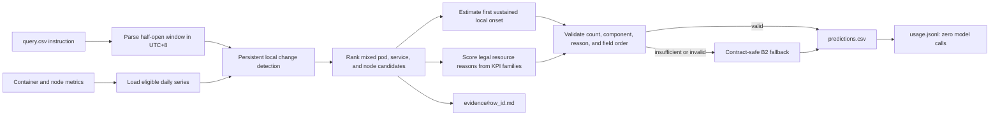

# MantisGrid Track 1: Deterministic Resource RCA

This submission diagnoses microservice incidents from container and node metrics. It
uses persistent local change points, mixed pod/service/node candidates, UTC+8 onset
estimation, resource-reason scoring, and a contract-safe fallback. The shipped default
agent is `agents.stage1_resource`.

## Measured results

The table below uses the unchanged official scorer on all 70 development cases.
These are development-set measurements, not hidden-evaluation estimates.

| configuration | mean score | strictly solved | empty answers |
|---|---:|---:|---:|
| Original heuristic (B0) | 0.073 | 2/70 | 24 |
| UTC+8 + contract-safe fallback (B2) | 0.157 | 4/70 | 0 |
| + rolling change-point ranking | 0.190 | 3/70 | 0 |
| + local-onset timestamps | 0.239 | 6/70 | 0 |
| **+ resource-reason scoring (shipped)** | **0.287** | **11/70** | **0** |

The shipped run averaged **1.61 seconds per case**, peaked at 7.93 seconds,
and made **zero model calls**, for measured model cost of **$0**. Candidate-source
ablation kept the rolling method: fixed-half scored 0.175 and the union scored
0.281 while taking 3.37 seconds per case. Full tables and limitations are in
[`REPORT.md`](REPORT.md) and [`eval/`](eval/).

## Architecture



The inference path reads only the supplied query instruction and telemetry. It
does not read development labels, answer files, evaluation artifacts, logs,
traces, or mesh data. The resource-only scope is deliberate and explains the
measured weakness on network failures.

## Run

```bash
python run.py --dataset /data --queries /data/query.csv --out /out
```

The command writes `predictions.csv`, `usage.jsonl`, and one
`evidence/<row_id>.md` file per query. The dataset is supplied at runtime and is not
included in this repository.

Build and run the image with:

```bash
docker build -t mantisgrid-track1 .
docker run --rm \
  -e FEATHERLESS_API_KEY \
  -e FEATHERLESS_BASE_URL \
  -v <dataset>:/data:ro \
  -v <empty-output-directory>:/out \
  mantisgrid-track1 \
  python run.py --dataset /data --queries /data/query.csv --out /out
```

For local validation with the development bundle:

```bash
make validate DATASET=/path/to/Market-cloudbed-1 \
  QUERIES=/path/to/Market-cloudbed-1/dev/query_dev.csv
```

## Shipped agent

The final runtime is deterministic and metric-only. It does not read labels,
`scoring_points`, development answers, logs, traces, mesh data, or evaluation
artifacts. It makes no model or external API calls. Consequently,
`FEATHERLESS_API_KEY` and `FEATHERLESS_BASE_URL` are accepted by the container
environment but are not consumed by this configuration. Runtime models are not
enabled.

Measured development results and limitations are documented in [REPORT.md](REPORT.md),
with compact supporting artifacts under `eval/`.

## AI-use disclosure

OpenAI Codex/ChatGPT assisted with telemetry analysis, deterministic implementation,
testing, evaluation scripts, and documentation. The team selected the final method and
validated the reported measurements with the provided official scorer. No AI model is
called by the submitted runtime.
