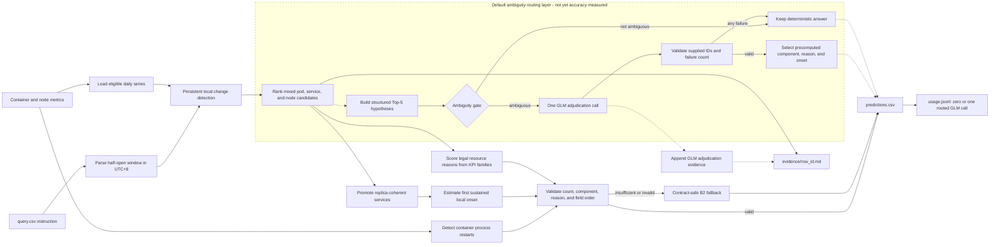

# MantisGrid Track 1 RCA submission

This submission diagnoses microservice incidents from container and node metrics. It
uses persistent local change points, mixed pod/service/node candidates, UTC+8 onset
estimation, resource-reason scoring, process-restart detection, coherent service
promotion, and a contract-safe fallback. The shipped default agent is
`agents.glm_escalation`, which ambiguity-routes to one GLM call when credentials
are available and otherwise retains the deterministic answer unchanged.

## Measured results

The table below uses the unchanged official scorer on all 70 development cases.
These are development-set measurements, not hidden-evaluation estimates.

| configuration | mean score | strictly solved | empty answers |
|---|---:|---:|---:|
| Original heuristic (B0) | 0.073 | 2/70 | 24 |
| UTC+8 + contract-safe fallback (B2) | 0.157 | 4/70 | 0 |
| + rolling change-point ranking | 0.190 | 3/70 | 0 |
| + local-onset timestamps | 0.239 | 6/70 | 0 |
| + resource-reason scoring (Stage 1) | 0.287 | 11/70 | 0 |
| + process-restart detection | 0.308 | 13/70 | 0 |
| **+ coherent service hierarchy (locked deterministic baseline)** | **0.317** | **14/70** | **0** |

### What each configuration adds

- **B0 — original heuristic:** ranks components by their largest robust metric
  anomaly, maps the winning KPI to a reason, and reports that KPI's peak time. Its
  UTC parsing error caused 24 empty answers.
- **B2 — UTC+8 and contract safety:** reads query windows in the telemetry's UTC+8
  timebase, validates failure count, field order, component, and reason, and emits a
  legal best guess when the baseline cannot form a complete answer.
- **Rolling change-point ranking:** detects persistent local changes and ranks a
  mixed candidate set containing exact pods, logical services, and nodes instead of
  relying only on the largest whole-window anomaly.
- **Local-onset timestamps:** dates each selected failure at the first sustained
  local transition rather than at the later peak of the affected metric.
- **Resource-reason scoring — Stage 1:** combines evidence across related KPI
  families to select the legal CPU, memory, disk, or I/O reason instead of using a
  single KPI keyword match.
- **Process-restart detection:** identifies an in-window change in container start
  time for reason-only requests and reports container process termination.
- **Coherent service hierarchy — final shipped:** promotes a logical service when
  at least two replicas show the same KPI direction near the same onset, while a
  lone affected replica remains an exact-pod candidate.

Each row in the table is cumulative: it adds the named change to the configuration
above it.

The reproduced final run averaged **1.83 seconds per case**, peaked at 7.93 seconds,
and made **zero model calls**, for measured model cost of **$0**. Candidate-source
ablation kept the rolling method: fixed-half scored 0.175 and the union scored
0.281 while taking 3.37 seconds per case. Full tables and limitations are in
[`REPORT.md`](REPORT.md) and [`eval/`](eval/).

## Evaluation harness

The harness is organized as a sequence of controlled, label-independent inference
runs followed by offline scoring:

- **Stage 0 contract audit:** isolates the UTC+8 repair and contract-safe fallback
  from the original B0 heuristic.
- **Stage 1 algorithm ablation:** adds rolling change-point ranking, local-onset
  timing, and resource-reason scoring one change at a time.
- **Candidate-source ablation:** compares rolling, fixed-half, and union candidate
  generators without changing the output contract.
- **Hierarchy and multi-failure ablation:** tests replica-coherent service promotion,
  reason-conditioned onset, and distinct-event selection.
- **Diagnostic scoring:** reports official score, strict solves, component
  Recall@1/3/5/10, 60-second timing accuracy, reason accuracy, task and fault-group
  results, failure-count slices, per-case changes, runtime, and model calls.
- **Release gates:** check unique row IDs, requested failure count, ordered and
  nonempty fields, legal components/reasons, UTC+8 bounds, and one evidence file per
  query.

### Release progression

| configuration | mean score | strictly solved | runtime (s/case) | decision |
|---|---:|---:|---:|---|
| Stage 1 resource baseline | 0.287 | 11/70 | 1.61 | superseded |
| + process-restart detection | 0.308 | 13/70 | 1.59 | superseded |
| **+ coherent service hierarchy** | **0.317** | **14/70** | **1.83** | **locked deterministic baseline** |

Against the process-restart version, hierarchy promotion improved rows 14, 20, and
30 and regressed rows 47 and 48; the strict-solve gate increased from 13 to 14. All
release configurations made zero model calls. These are internal development-set
measurements, not hidden-set performance.

## Architecture



The inference path reads only the supplied query instruction and telemetry. It
does not read development labels, answer files, evaluation artifacts, logs,
traces, or mesh data. The resource-only scope is deliberate and explains the
measured weakness on network failures.

The deterministic fallback architecture is:

`query → UTC+8 window parsing → rolling persistent change detection → mixed
pod/service/node candidates → process-restart detection → hierarchy promotion →
resource-reason scoring → local onset → contract validation → grounded evidence`.

## Run

```bash
python run.py --dataset /data --queries /data/query.csv --out /out
```

The command writes `predictions.csv`, `usage.jsonl`, and one
`evidence/<row_id>.md` file per query. The dataset is supplied at runtime and is not
included in this repository.

Build and run the image with:

```bash
docker build -t mantisgrid-track1 .
docker run --rm \
  -e FEATHERLESS_API_KEY \
  -e FEATHERLESS_BASE_URL \
  -v <dataset>:/data:ro \
  -v <empty-output-directory>:/out \
  mantisgrid-track1 \
  python run.py --dataset /data --queries /data/query.csv --out /out
```

For local validation with the development bundle:

```bash
make validate DATASET=/path/to/Market-cloudbed-1 \
  QUERIES=/path/to/Market-cloudbed-1/dev/query_dev.csv
```

## Shipped agent

The default runtime is `agents.glm_escalation`. Its deterministic foundation does
not read labels,
`scoring_points`, development answers, logs, traces, mesh data, or evaluation
artifacts. When the structured evidence is ambiguous and credentials are available,
the routing layer may make one adjudication call; any missing credential, API/model
failure, timeout, invalid selection, or contract failure retains the exact
deterministic answer.

Measured development results and limitations are documented in [REPORT.md](REPORT.md),
with compact supporting artifacts under `eval/`.

## Default GLM escalation

`agents.glm_escalation` is the default ambiguity adjudicator. It sends at most five
structured, precomputed
hypotheses and their evidence IDs to at most one GLM completion, validates that
the response selects known hypothesis IDs with the required failure count, and
retains the exact deterministic answer on any missing credential, API error,
timeout, malformed response, or contract failure. It never asks the model to
generate components, reasons, timestamps, KPIs, or telemetry values.

The routed agent prefers `zai-org/GLM-5.2` and selects
`zai-org/GLM-5.1` only when the model catalog shows that the primary is
unavailable. It has not received a final accuracy evaluation, so no GLM score or
promotion claim is made. The reported 0.317/14 result remains the locked
deterministic fallback measurement.

```bash
python run.py --dataset /data --queries /data/query.csv --out /out
```

Container execution was not locally verified because no runtime is installed.

## AI-use disclosure

OpenAI Codex/ChatGPT assisted with telemetry analysis, deterministic implementation,
testing, evaluation scripts, and documentation. The team selected the final method and
validated the reported measurements with the provided official scorer. No AI model was
called in the locked deterministic measurement.
